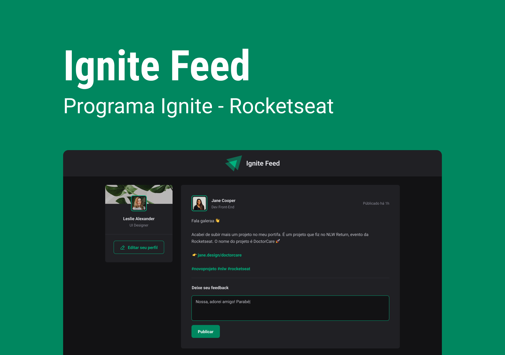

<!-- <h1 align="center">Ignite Feed</h1> -->
<div align="center"></div>
<div align="center" id="top"> 
  <!--  -->

&#xa0;

<a href="https://ignitefeed-coral.vercel.app/">Demo</a>

</div>

<br />

<p align="center">
  

  

  

  

  

  

  
</p>

<h1 align="center">
 App está Concluído 🚀🚀
</h1>

<!-- <hr> -->

<p align="center">
  <a href="#dart-sobre">Sobre</a> &#xa0; | &#xa0; 
  <a href="#sparkles-funcionalidades">Funcionalidades</a> &#xa0; | &#xa0;
  <a href="#rocket-tecnologias">Tecnologias</a> &#xa0; | &#xa0;
  <a href="#white_check_mark-pré-requisitos">Pré requisitos</a> &#xa0; | &#xa0;
  <a href="#checkered_flag-começando">Começando</a> &#xa0; | &#xa0;
  <a href="#raised_hands-contribuir">Contribuir</a> &#xa0; | &#xa0;
  <a href="#memo-licença">Licença</a> &#xa0; | &#xa0;
  <a href="https://github.com/gabrieljuniorferrari88" target="_blank">Autor</a>
</p>
<br>

## :dart: Sobre

Aplicativo desenvolvido no treinamento [Ignite](https://www.rocketseat.com.br/ignite) da [Rocketseat](https://www.rocketseat.com.br/) na trilha de ReactJs. O website foi pensado em criar um feed de posts e comentários.

## :sparkles: Funcionalidades

:heavy_check_mark: Comentar e aplaudir;\

## :rocket: Tecnologias

As seguintes ferramentas foram usadas na construção do projeto:

- [JavaScript](https://developer.mozilla.org/pt-BR/docs/Web/JavaScript)
- [TypeScript](https://www.typescriptlang.org)
- [date-fns](https://date-fns.org)
- [phosphor-react](https://phosphoricons.com/)
- [vite](https://vitejs.dev/)

## :white_check_mark: Pré-requisitos

Antes de começar :checkered_flag:, você precisa ter o [Git](https://git-scm.com) e o [Node](https://nodejs.org/en/) instalados em sua maquina.

## :checkered_flag: Começando

```bash
# Clone este repositório
$ git clone https://github.com/gabrieljuniorferrari88/ignitefeed

# Entre na pasta
$ cd ignitefeed

# Instale as dependências
$ yarn ou npm install

# Para iniciar o projeto
$ yarn dev

# A aplicação vai inicializar em <http://localhost:3001>
```

## :raised_hands: Contribuir

1. Faça um **fork** do projeto.
2. Crie uma nova branch com as suas alterações: `git checkout -b my-feature`
3. Salve as alterações e crie uma mensagem de commit contando o que você fez: `git commit -m "feature: My new feature"`
4. Envie as suas alterações: `git push origin my-feature`
   > Caso tenha alguma dúvida confira este [guia de como contribuir no GitHub](https://github.com/firstcontributions/first-contributions)

## :sunrise: Conquistas

:heavy_check_mark: Criando uma aplicação usando o Vite, e aprendendo a estrutura do projeto, usando typescript;🚀\
:heavy_check_mark: Conhecimento do Css Module;🚀\
:heavy_check_mark: Criação de components e suas propriedades;🚀\
:heavy_check_mark: Compreensão do useState e tipagem;🚀\
:heavy_check_mark: Validação de formulários com o próprio javascript;🚀\

## :memo: Licença

Este projeto está sob licença MIT. Veja o arquivo [LICENSE](LICENSE) para mais detalhes.

Feito com :heart: por <a href="https://github.com/gabrieljuniorferrari88" target="_blank">Gabriel Ferrari</a>

&#xa0;

<a href="#top">Voltar para o topo</a>
